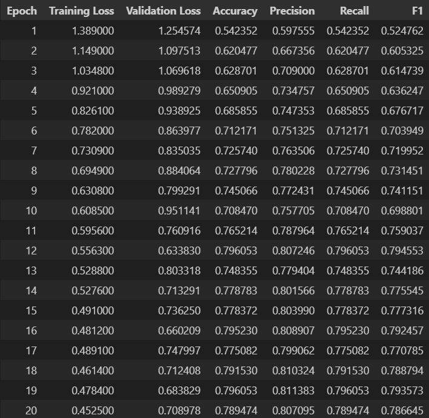
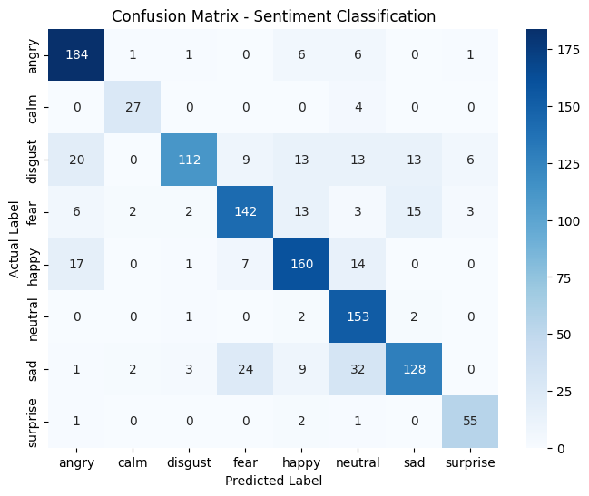
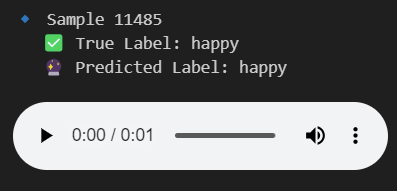

# 🗣️ Speech Emotion Recognition & Audio Transcription Using Wav2Vec2

---

## 📋 Project Overview

This repository implements a **Speech Emotion Recognition (SER)** and **Automatic Speech Recognition (ASR)** pipeline based on **Wav2Vec2** pre-trained models.  
The goal is to detect the emotional state from raw speech audio and transcribe spoken content into text.  

Tasks addressed:

- **Emotion Classification** (e.g., Happy, Sad, Angry, etc.)
- **Audio-to-Text Transcription** (using ASR model)

---

## 📚 Datasets

We combined several popular open-source emotional speech datasets:

- **CREMA-D** (Crowd-sourced Emotional Multimodal Actors Dataset)
- **RAVDESS** (Ryerson Audio-Visual Database of Emotional Speech and Song)
- **TESS** (Toronto Emotional Speech Set)
- **SAVEE** (Surrey Audio-Visual Expressed Emotion)

> All datasets were downloaded automatically using the `kagglehub` library.

### 🏷️ Supported Emotion Classes

- Neutral
- Happy
- Sad
- Angry
- Fear
- Disgust
- Surprise
- Calm

Each dataset has its own labeling format; a unified mapping was applied to create a consistent labeling system across datasets.

---

## ⚙️ Data Preprocessing

- `.wav` files were traversed recursively.
- Emotion labels were extracted based on filename patterns.
- Only 8 main emotions were retained.
- Samples were **split into Train/Validation/Test** sets:
  - Train: 70%
  - Validation: 20%
  - Test: 10%
- Class distribution for each split was visualized using bar plots.

The splits were saved as CSV files:
```
train_dataset.csv
valid_dataset.csv
test_dataset.csv
```

---

## 🧠 Model Architecture

### 🗣️ Speech Emotion Recognition (SER)

- **Base Model:** `facebook/wav2vec2-large-xlsr-53`
- **Head:** Classification head for 8 emotion classes.
- **Feature Extractor:** `Wav2Vec2FeatureExtractor` from Hugging Face Transformers.

Model fine-tuned on emotional labels with:

- Input sampling rate: 16kHz
- Input length: 2 seconds (32000 samples)
- Padding or trimming applied as needed

### 📝 Audio Transcription (ASR)

- **Model:** `facebook/wav2vec2-large-960h`
- **Processor:** `Wav2Vec2Processor`
- Transcribes input audio to text in English.

---

## 🏋️ Training Procedure

- **Trainer API** (from Hugging Face) used for model fine-tuning.
- **Loss Function:** CrossEntropyLoss
- **Optimizer:** AdamW
- **Training Arguments:**
  - Epochs: 20
  - Learning Rate: 2e-5
  - Batch Size: 32
  - Mixed Precision: Enabled (fp16)
  - Evaluation Strategy: Every epoch

The model checkpoints and results were saved under the `./results_sentiment` directory.

---

## 📈 Evaluation Metrics

After training, the model was evaluated on the **test set** using:

- **Accuracy**
- **Precision**
- **Recall**
- **F1-Score**
- **Confusion Matrix**

### 🔥 Final Test Set Results



### 📊 Confusion Matrix




## 🔥 Live Predictions

Random samples from the **test set** were selected and predictions were made.  
For each sample:

- **True label** vs **Predicted label** printed.
- Audio playback available directly inside notebook (using `IPython.display.Audio`).

Example:

  


## ✨ Audio Transcription Feature

In addition to emotion detection, the project includes **speech-to-text transcription** using a separately pre-trained **ASR model**:

- Audio files (max 2.5s) were processed and decoded into English text.
- Transcriptions were printed alongside actual audio playback.

Example output:

  

(Audio plays)
---

## 🛠 Technical Stack

- **Python 3.10**
- **PyTorch** for deep learning model implementation
- **Hugging Face Transformers** for pre-trained model loading
- **Librosa** for audio processing
- **Scikit-learn** for evaluation metrics
- **Seaborn/Matplotlib** for visualization
- **kagglehub** for automatic dataset download

---

## 🚀 How to Run the Project

1. Install dependencies:
   ```bash
   pip install torch librosa transformers kagglehub scikit-learn matplotlib seaborn pandas
   ```

2. Clone the repository and navigate inside:
   ```bash
   git clone //github.com/Seyed07/Speech-Emotion-Recognition-using-Wav2Vec2.git
   ```
3. Run the Jupyter notebook:
   ```bash
   jupyter notebook
   ```

4. Execute all cells step-by-step to train and evaluate the models.

---

## 📬 Contact

For any questions or suggestions, feel free to create an issue or contact me via email or GitHub.
